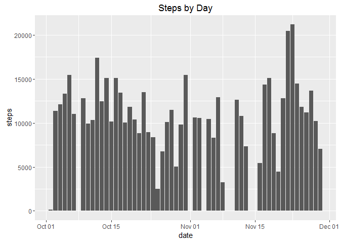
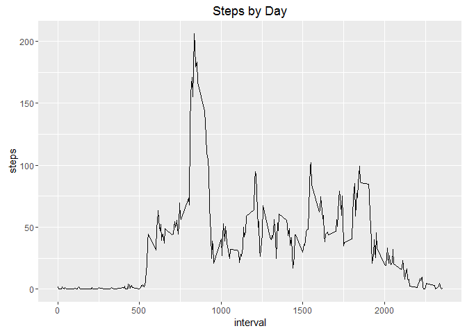
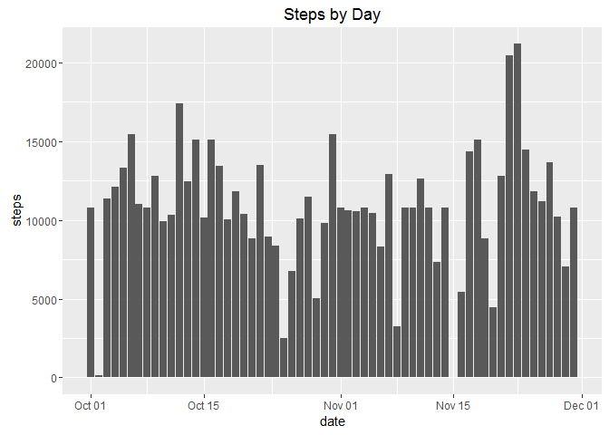
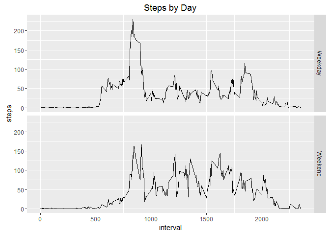

# Reproducible Research: Peer Assessment 1

This document outlines the steps taken to read and process a set of 
activity monitoring data.

*Read In Data:*


```r
        actData<-read.csv("activity.csv")
        
        ##coerce dates to date type
        actData$date<-as.Date(actData$date,"%Y-%m-%d")
```
Once the data has been read in we can undertake initial analysis of the data:

```r
                library(ggplot2)
```

```
## Warning: package 'ggplot2' was built under R version 3.2.5
```

```r
        plotObj<-ggplot(actData,aes(date,steps)) + 
                stat_summary(fun.y=sum, geom="bar") + labs(title
                ="Steps by Day")
        
        print(plotObj)
```

```
## Warning: Removed 2304 rows containing non-finite values (stat_summary).
```



Mean & Median Steps per day calculated as follows

```r
   library(xtable)
```

```
## Warning: package 'xtable' was built under R version 3.2.5
```

```r
       daymean<-tapply(actData$steps,actData$date,mean, na.rm=TRUE)
       daymedian<-tapply(actData$steps,actData$date,median, na.rm=TRUE)
       
       df<-data.frame(mean_steps=daymean,median_steps=daymedian)
       xt<-xtable(df)
       print(xt, type="html")
```

<!-- html table generated in R 3.2.3 by xtable 1.8-2 package -->
<!-- Fri Jul 08 21:47:01 2016 -->
<table border=1>
<tr> <th>  </th> <th> mean_steps </th> <th> median_steps </th>  </tr>
  <tr> <td align="right"> 2012-10-01 </td> <td align="right">  </td> <td align="right">  </td> </tr>
  <tr> <td align="right"> 2012-10-02 </td> <td align="right"> 0.44 </td> <td align="right"> 0.00 </td> </tr>
  <tr> <td align="right"> 2012-10-03 </td> <td align="right"> 39.42 </td> <td align="right"> 0.00 </td> </tr>
  <tr> <td align="right"> 2012-10-04 </td> <td align="right"> 42.07 </td> <td align="right"> 0.00 </td> </tr>
  <tr> <td align="right"> 2012-10-05 </td> <td align="right"> 46.16 </td> <td align="right"> 0.00 </td> </tr>
  <tr> <td align="right"> 2012-10-06 </td> <td align="right"> 53.54 </td> <td align="right"> 0.00 </td> </tr>
  <tr> <td align="right"> 2012-10-07 </td> <td align="right"> 38.25 </td> <td align="right"> 0.00 </td> </tr>
  <tr> <td align="right"> 2012-10-08 </td> <td align="right">  </td> <td align="right">  </td> </tr>
  <tr> <td align="right"> 2012-10-09 </td> <td align="right"> 44.48 </td> <td align="right"> 0.00 </td> </tr>
  <tr> <td align="right"> 2012-10-10 </td> <td align="right"> 34.38 </td> <td align="right"> 0.00 </td> </tr>
  <tr> <td align="right"> 2012-10-11 </td> <td align="right"> 35.78 </td> <td align="right"> 0.00 </td> </tr>
  <tr> <td align="right"> 2012-10-12 </td> <td align="right"> 60.35 </td> <td align="right"> 0.00 </td> </tr>
  <tr> <td align="right"> 2012-10-13 </td> <td align="right"> 43.15 </td> <td align="right"> 0.00 </td> </tr>
  <tr> <td align="right"> 2012-10-14 </td> <td align="right"> 52.42 </td> <td align="right"> 0.00 </td> </tr>
  <tr> <td align="right"> 2012-10-15 </td> <td align="right"> 35.20 </td> <td align="right"> 0.00 </td> </tr>
  <tr> <td align="right"> 2012-10-16 </td> <td align="right"> 52.38 </td> <td align="right"> 0.00 </td> </tr>
  <tr> <td align="right"> 2012-10-17 </td> <td align="right"> 46.71 </td> <td align="right"> 0.00 </td> </tr>
  <tr> <td align="right"> 2012-10-18 </td> <td align="right"> 34.92 </td> <td align="right"> 0.00 </td> </tr>
  <tr> <td align="right"> 2012-10-19 </td> <td align="right"> 41.07 </td> <td align="right"> 0.00 </td> </tr>
  <tr> <td align="right"> 2012-10-20 </td> <td align="right"> 36.09 </td> <td align="right"> 0.00 </td> </tr>
  <tr> <td align="right"> 2012-10-21 </td> <td align="right"> 30.63 </td> <td align="right"> 0.00 </td> </tr>
  <tr> <td align="right"> 2012-10-22 </td> <td align="right"> 46.74 </td> <td align="right"> 0.00 </td> </tr>
  <tr> <td align="right"> 2012-10-23 </td> <td align="right"> 30.97 </td> <td align="right"> 0.00 </td> </tr>
  <tr> <td align="right"> 2012-10-24 </td> <td align="right"> 29.01 </td> <td align="right"> 0.00 </td> </tr>
  <tr> <td align="right"> 2012-10-25 </td> <td align="right"> 8.65 </td> <td align="right"> 0.00 </td> </tr>
  <tr> <td align="right"> 2012-10-26 </td> <td align="right"> 23.53 </td> <td align="right"> 0.00 </td> </tr>
  <tr> <td align="right"> 2012-10-27 </td> <td align="right"> 35.14 </td> <td align="right"> 0.00 </td> </tr>
  <tr> <td align="right"> 2012-10-28 </td> <td align="right"> 39.78 </td> <td align="right"> 0.00 </td> </tr>
  <tr> <td align="right"> 2012-10-29 </td> <td align="right"> 17.42 </td> <td align="right"> 0.00 </td> </tr>
  <tr> <td align="right"> 2012-10-30 </td> <td align="right"> 34.09 </td> <td align="right"> 0.00 </td> </tr>
  <tr> <td align="right"> 2012-10-31 </td> <td align="right"> 53.52 </td> <td align="right"> 0.00 </td> </tr>
  <tr> <td align="right"> 2012-11-01 </td> <td align="right">  </td> <td align="right">  </td> </tr>
  <tr> <td align="right"> 2012-11-02 </td> <td align="right"> 36.81 </td> <td align="right"> 0.00 </td> </tr>
  <tr> <td align="right"> 2012-11-03 </td> <td align="right"> 36.70 </td> <td align="right"> 0.00 </td> </tr>
  <tr> <td align="right"> 2012-11-04 </td> <td align="right">  </td> <td align="right">  </td> </tr>
  <tr> <td align="right"> 2012-11-05 </td> <td align="right"> 36.25 </td> <td align="right"> 0.00 </td> </tr>
  <tr> <td align="right"> 2012-11-06 </td> <td align="right"> 28.94 </td> <td align="right"> 0.00 </td> </tr>
  <tr> <td align="right"> 2012-11-07 </td> <td align="right"> 44.73 </td> <td align="right"> 0.00 </td> </tr>
  <tr> <td align="right"> 2012-11-08 </td> <td align="right"> 11.18 </td> <td align="right"> 0.00 </td> </tr>
  <tr> <td align="right"> 2012-11-09 </td> <td align="right">  </td> <td align="right">  </td> </tr>
  <tr> <td align="right"> 2012-11-10 </td> <td align="right">  </td> <td align="right">  </td> </tr>
  <tr> <td align="right"> 2012-11-11 </td> <td align="right"> 43.78 </td> <td align="right"> 0.00 </td> </tr>
  <tr> <td align="right"> 2012-11-12 </td> <td align="right"> 37.38 </td> <td align="right"> 0.00 </td> </tr>
  <tr> <td align="right"> 2012-11-13 </td> <td align="right"> 25.47 </td> <td align="right"> 0.00 </td> </tr>
  <tr> <td align="right"> 2012-11-14 </td> <td align="right">  </td> <td align="right">  </td> </tr>
  <tr> <td align="right"> 2012-11-15 </td> <td align="right"> 0.14 </td> <td align="right"> 0.00 </td> </tr>
  <tr> <td align="right"> 2012-11-16 </td> <td align="right"> 18.89 </td> <td align="right"> 0.00 </td> </tr>
  <tr> <td align="right"> 2012-11-17 </td> <td align="right"> 49.79 </td> <td align="right"> 0.00 </td> </tr>
  <tr> <td align="right"> 2012-11-18 </td> <td align="right"> 52.47 </td> <td align="right"> 0.00 </td> </tr>
  <tr> <td align="right"> 2012-11-19 </td> <td align="right"> 30.70 </td> <td align="right"> 0.00 </td> </tr>
  <tr> <td align="right"> 2012-11-20 </td> <td align="right"> 15.53 </td> <td align="right"> 0.00 </td> </tr>
  <tr> <td align="right"> 2012-11-21 </td> <td align="right"> 44.40 </td> <td align="right"> 0.00 </td> </tr>
  <tr> <td align="right"> 2012-11-22 </td> <td align="right"> 70.93 </td> <td align="right"> 0.00 </td> </tr>
  <tr> <td align="right"> 2012-11-23 </td> <td align="right"> 73.59 </td> <td align="right"> 0.00 </td> </tr>
  <tr> <td align="right"> 2012-11-24 </td> <td align="right"> 50.27 </td> <td align="right"> 0.00 </td> </tr>
  <tr> <td align="right"> 2012-11-25 </td> <td align="right"> 41.09 </td> <td align="right"> 0.00 </td> </tr>
  <tr> <td align="right"> 2012-11-26 </td> <td align="right"> 38.76 </td> <td align="right"> 0.00 </td> </tr>
  <tr> <td align="right"> 2012-11-27 </td> <td align="right"> 47.38 </td> <td align="right"> 0.00 </td> </tr>
  <tr> <td align="right"> 2012-11-28 </td> <td align="right"> 35.36 </td> <td align="right"> 0.00 </td> </tr>
  <tr> <td align="right"> 2012-11-29 </td> <td align="right"> 24.47 </td> <td align="right"> 0.00 </td> </tr>
  <tr> <td align="right"> 2012-11-30 </td> <td align="right">  </td> <td align="right">  </td> </tr>
   </table>

Reviewing the number of steps per interval we have created the following plot

```r
        plotObj<-ggplot(actData,aes(interval,steps)) + 
                stat_summary(fun.y=mean,geom="line") + labs(title
                                                          ="Steps by Day")
        
        print(plotObj)
```

```
## Warning: Removed 2304 rows containing non-finite values (stat_summary).
```



```r
        avestep<-tapply(actData$steps,actData$interval,mean,na.rm=TRUE)
        maxInt<-max(avestep)
        avestep[avestep==maxInt]
```

```
##      835 
## 206.1698
```
The maximum average number of steps in an interval is 206.1698113 in interval 835


```r
   num_NAs<-sum(is.na(actData$steps))
```

The original dataset contains 2304 NA values.

## Imputing missing values
I've decided to use the following strategy where the number of steps is missing
- Where the mean number of steps per interval is available use this
- otherwise use 0 - given a large number of these are liekly to be overnight
with limited movement


```r
        library(plyr)
```

```
## Warning: package 'plyr' was built under R version 3.2.5
```

```r
        missingvals<-is.na(actData$steps)
        no_missing<-nrow(actData[missingvals,])
        
        #generate lookup sequence
        x<-seq(0,2355,5)
        y<-rep(0,length(x))
        df<-data.frame(interval=x,avesteps=y)
        df2<-data.frame(interval=rownames(avestep),as=avestep)
        df2$interval<-as.character(df2$interval)
        df2$interval<-as.numeric(df2$interval)
        df3<-join(df,df2)
```

```
## Joining by: interval
```

```r
        df3$calcstep<-ifelse(is.na(df3$as),0,df3$as)
        
        actData2<-actData
        actData2$date<-as.Date(actData2$date, "%Y-%m-%d")
        actData2red<-actData[missingvals,]
        actData2red$date<-as.Date(actData2red$date, "%Y-%m-%d")
        
        for (i in 1:no_missing) {
                #get interval
                reqint<-actData2red$interval[i]
                
                reqdate<-actData2red$date[i]
                
                #returnval
                        actData2$steps[actData2$interval==reqint & actData2$date==reqdate]<-df3$calcstep[df3$interval==reqint]
                }
        
        newNAs<-sum(is.na(actData2$steps))     
```

The number of NAs now present in the data is 0

The new data set now looks as follows:


```r
        plotObj<-ggplot(actData2,aes(date,steps)) + 
                stat_summary(fun.y=sum,geom="bar") + labs(title
                ="Steps by Day")
        
        print(plotObj)
```



The comparison to the previous mean and media values is shown in the resultant table


```r
   library(xtable)
        
       daymean<-tapply(actData$steps,actData$date,mean, na.rm=TRUE)
       newmean<-tapply(actData2$steps,actData2$date,mean, na.rm=TRUE)
       mean.dif<-newmean-daymean
       daymedian<-tapply(actData$steps,actData$date,median, na.rm=TRUE)
       newmedian<-tapply(actData2$steps,actData2$date,median, na.rm=TRUE)
       
       
       df4<-data.frame(mean_steps=daymean,new_mean=newmean,diff=mean.dif,
                      median_steps=daymedian,new_median=newmedian)
       xt<-xtable(df4)
       print(xt, type="html")
```

<!-- html table generated in R 3.2.3 by xtable 1.8-2 package -->
<!-- Fri Jul 08 21:47:03 2016 -->
<table border=1>
<tr> <th>  </th> <th> mean_steps </th> <th> new_mean </th> <th> diff </th> <th> median_steps </th> <th> new_median </th>  </tr>
  <tr> <td align="right"> 2012-10-01 </td> <td align="right">  </td> <td align="right"> 37.38 </td> <td align="right">  </td> <td align="right">  </td> <td align="right"> 34.11 </td> </tr>
  <tr> <td align="right"> 2012-10-02 </td> <td align="right"> 0.44 </td> <td align="right"> 0.44 </td> <td align="right"> 0.00 </td> <td align="right"> 0.00 </td> <td align="right"> 0.00 </td> </tr>
  <tr> <td align="right"> 2012-10-03 </td> <td align="right"> 39.42 </td> <td align="right"> 39.42 </td> <td align="right"> 0.00 </td> <td align="right"> 0.00 </td> <td align="right"> 0.00 </td> </tr>
  <tr> <td align="right"> 2012-10-04 </td> <td align="right"> 42.07 </td> <td align="right"> 42.07 </td> <td align="right"> 0.00 </td> <td align="right"> 0.00 </td> <td align="right"> 0.00 </td> </tr>
  <tr> <td align="right"> 2012-10-05 </td> <td align="right"> 46.16 </td> <td align="right"> 46.16 </td> <td align="right"> 0.00 </td> <td align="right"> 0.00 </td> <td align="right"> 0.00 </td> </tr>
  <tr> <td align="right"> 2012-10-06 </td> <td align="right"> 53.54 </td> <td align="right"> 53.54 </td> <td align="right"> 0.00 </td> <td align="right"> 0.00 </td> <td align="right"> 0.00 </td> </tr>
  <tr> <td align="right"> 2012-10-07 </td> <td align="right"> 38.25 </td> <td align="right"> 38.25 </td> <td align="right"> 0.00 </td> <td align="right"> 0.00 </td> <td align="right"> 0.00 </td> </tr>
  <tr> <td align="right"> 2012-10-08 </td> <td align="right">  </td> <td align="right"> 37.38 </td> <td align="right">  </td> <td align="right">  </td> <td align="right"> 34.11 </td> </tr>
  <tr> <td align="right"> 2012-10-09 </td> <td align="right"> 44.48 </td> <td align="right"> 44.48 </td> <td align="right"> 0.00 </td> <td align="right"> 0.00 </td> <td align="right"> 0.00 </td> </tr>
  <tr> <td align="right"> 2012-10-10 </td> <td align="right"> 34.38 </td> <td align="right"> 34.38 </td> <td align="right"> 0.00 </td> <td align="right"> 0.00 </td> <td align="right"> 0.00 </td> </tr>
  <tr> <td align="right"> 2012-10-11 </td> <td align="right"> 35.78 </td> <td align="right"> 35.78 </td> <td align="right"> 0.00 </td> <td align="right"> 0.00 </td> <td align="right"> 0.00 </td> </tr>
  <tr> <td align="right"> 2012-10-12 </td> <td align="right"> 60.35 </td> <td align="right"> 60.35 </td> <td align="right"> 0.00 </td> <td align="right"> 0.00 </td> <td align="right"> 0.00 </td> </tr>
  <tr> <td align="right"> 2012-10-13 </td> <td align="right"> 43.15 </td> <td align="right"> 43.15 </td> <td align="right"> 0.00 </td> <td align="right"> 0.00 </td> <td align="right"> 0.00 </td> </tr>
  <tr> <td align="right"> 2012-10-14 </td> <td align="right"> 52.42 </td> <td align="right"> 52.42 </td> <td align="right"> 0.00 </td> <td align="right"> 0.00 </td> <td align="right"> 0.00 </td> </tr>
  <tr> <td align="right"> 2012-10-15 </td> <td align="right"> 35.20 </td> <td align="right"> 35.20 </td> <td align="right"> 0.00 </td> <td align="right"> 0.00 </td> <td align="right"> 0.00 </td> </tr>
  <tr> <td align="right"> 2012-10-16 </td> <td align="right"> 52.38 </td> <td align="right"> 52.38 </td> <td align="right"> 0.00 </td> <td align="right"> 0.00 </td> <td align="right"> 0.00 </td> </tr>
  <tr> <td align="right"> 2012-10-17 </td> <td align="right"> 46.71 </td> <td align="right"> 46.71 </td> <td align="right"> 0.00 </td> <td align="right"> 0.00 </td> <td align="right"> 0.00 </td> </tr>
  <tr> <td align="right"> 2012-10-18 </td> <td align="right"> 34.92 </td> <td align="right"> 34.92 </td> <td align="right"> 0.00 </td> <td align="right"> 0.00 </td> <td align="right"> 0.00 </td> </tr>
  <tr> <td align="right"> 2012-10-19 </td> <td align="right"> 41.07 </td> <td align="right"> 41.07 </td> <td align="right"> 0.00 </td> <td align="right"> 0.00 </td> <td align="right"> 0.00 </td> </tr>
  <tr> <td align="right"> 2012-10-20 </td> <td align="right"> 36.09 </td> <td align="right"> 36.09 </td> <td align="right"> 0.00 </td> <td align="right"> 0.00 </td> <td align="right"> 0.00 </td> </tr>
  <tr> <td align="right"> 2012-10-21 </td> <td align="right"> 30.63 </td> <td align="right"> 30.63 </td> <td align="right"> 0.00 </td> <td align="right"> 0.00 </td> <td align="right"> 0.00 </td> </tr>
  <tr> <td align="right"> 2012-10-22 </td> <td align="right"> 46.74 </td> <td align="right"> 46.74 </td> <td align="right"> 0.00 </td> <td align="right"> 0.00 </td> <td align="right"> 0.00 </td> </tr>
  <tr> <td align="right"> 2012-10-23 </td> <td align="right"> 30.97 </td> <td align="right"> 30.97 </td> <td align="right"> 0.00 </td> <td align="right"> 0.00 </td> <td align="right"> 0.00 </td> </tr>
  <tr> <td align="right"> 2012-10-24 </td> <td align="right"> 29.01 </td> <td align="right"> 29.01 </td> <td align="right"> 0.00 </td> <td align="right"> 0.00 </td> <td align="right"> 0.00 </td> </tr>
  <tr> <td align="right"> 2012-10-25 </td> <td align="right"> 8.65 </td> <td align="right"> 8.65 </td> <td align="right"> 0.00 </td> <td align="right"> 0.00 </td> <td align="right"> 0.00 </td> </tr>
  <tr> <td align="right"> 2012-10-26 </td> <td align="right"> 23.53 </td> <td align="right"> 23.53 </td> <td align="right"> 0.00 </td> <td align="right"> 0.00 </td> <td align="right"> 0.00 </td> </tr>
  <tr> <td align="right"> 2012-10-27 </td> <td align="right"> 35.14 </td> <td align="right"> 35.14 </td> <td align="right"> 0.00 </td> <td align="right"> 0.00 </td> <td align="right"> 0.00 </td> </tr>
  <tr> <td align="right"> 2012-10-28 </td> <td align="right"> 39.78 </td> <td align="right"> 39.78 </td> <td align="right"> 0.00 </td> <td align="right"> 0.00 </td> <td align="right"> 0.00 </td> </tr>
  <tr> <td align="right"> 2012-10-29 </td> <td align="right"> 17.42 </td> <td align="right"> 17.42 </td> <td align="right"> 0.00 </td> <td align="right"> 0.00 </td> <td align="right"> 0.00 </td> </tr>
  <tr> <td align="right"> 2012-10-30 </td> <td align="right"> 34.09 </td> <td align="right"> 34.09 </td> <td align="right"> 0.00 </td> <td align="right"> 0.00 </td> <td align="right"> 0.00 </td> </tr>
  <tr> <td align="right"> 2012-10-31 </td> <td align="right"> 53.52 </td> <td align="right"> 53.52 </td> <td align="right"> 0.00 </td> <td align="right"> 0.00 </td> <td align="right"> 0.00 </td> </tr>
  <tr> <td align="right"> 2012-11-01 </td> <td align="right">  </td> <td align="right"> 37.38 </td> <td align="right">  </td> <td align="right">  </td> <td align="right"> 34.11 </td> </tr>
  <tr> <td align="right"> 2012-11-02 </td> <td align="right"> 36.81 </td> <td align="right"> 36.81 </td> <td align="right"> 0.00 </td> <td align="right"> 0.00 </td> <td align="right"> 0.00 </td> </tr>
  <tr> <td align="right"> 2012-11-03 </td> <td align="right"> 36.70 </td> <td align="right"> 36.70 </td> <td align="right"> 0.00 </td> <td align="right"> 0.00 </td> <td align="right"> 0.00 </td> </tr>
  <tr> <td align="right"> 2012-11-04 </td> <td align="right">  </td> <td align="right"> 37.38 </td> <td align="right">  </td> <td align="right">  </td> <td align="right"> 34.11 </td> </tr>
  <tr> <td align="right"> 2012-11-05 </td> <td align="right"> 36.25 </td> <td align="right"> 36.25 </td> <td align="right"> 0.00 </td> <td align="right"> 0.00 </td> <td align="right"> 0.00 </td> </tr>
  <tr> <td align="right"> 2012-11-06 </td> <td align="right"> 28.94 </td> <td align="right"> 28.94 </td> <td align="right"> 0.00 </td> <td align="right"> 0.00 </td> <td align="right"> 0.00 </td> </tr>
  <tr> <td align="right"> 2012-11-07 </td> <td align="right"> 44.73 </td> <td align="right"> 44.73 </td> <td align="right"> 0.00 </td> <td align="right"> 0.00 </td> <td align="right"> 0.00 </td> </tr>
  <tr> <td align="right"> 2012-11-08 </td> <td align="right"> 11.18 </td> <td align="right"> 11.18 </td> <td align="right"> 0.00 </td> <td align="right"> 0.00 </td> <td align="right"> 0.00 </td> </tr>
  <tr> <td align="right"> 2012-11-09 </td> <td align="right">  </td> <td align="right"> 37.38 </td> <td align="right">  </td> <td align="right">  </td> <td align="right"> 34.11 </td> </tr>
  <tr> <td align="right"> 2012-11-10 </td> <td align="right">  </td> <td align="right"> 37.38 </td> <td align="right">  </td> <td align="right">  </td> <td align="right"> 34.11 </td> </tr>
  <tr> <td align="right"> 2012-11-11 </td> <td align="right"> 43.78 </td> <td align="right"> 43.78 </td> <td align="right"> 0.00 </td> <td align="right"> 0.00 </td> <td align="right"> 0.00 </td> </tr>
  <tr> <td align="right"> 2012-11-12 </td> <td align="right"> 37.38 </td> <td align="right"> 37.38 </td> <td align="right"> 0.00 </td> <td align="right"> 0.00 </td> <td align="right"> 0.00 </td> </tr>
  <tr> <td align="right"> 2012-11-13 </td> <td align="right"> 25.47 </td> <td align="right"> 25.47 </td> <td align="right"> 0.00 </td> <td align="right"> 0.00 </td> <td align="right"> 0.00 </td> </tr>
  <tr> <td align="right"> 2012-11-14 </td> <td align="right">  </td> <td align="right"> 37.38 </td> <td align="right">  </td> <td align="right">  </td> <td align="right"> 34.11 </td> </tr>
  <tr> <td align="right"> 2012-11-15 </td> <td align="right"> 0.14 </td> <td align="right"> 0.14 </td> <td align="right"> 0.00 </td> <td align="right"> 0.00 </td> <td align="right"> 0.00 </td> </tr>
  <tr> <td align="right"> 2012-11-16 </td> <td align="right"> 18.89 </td> <td align="right"> 18.89 </td> <td align="right"> 0.00 </td> <td align="right"> 0.00 </td> <td align="right"> 0.00 </td> </tr>
  <tr> <td align="right"> 2012-11-17 </td> <td align="right"> 49.79 </td> <td align="right"> 49.79 </td> <td align="right"> 0.00 </td> <td align="right"> 0.00 </td> <td align="right"> 0.00 </td> </tr>
  <tr> <td align="right"> 2012-11-18 </td> <td align="right"> 52.47 </td> <td align="right"> 52.47 </td> <td align="right"> 0.00 </td> <td align="right"> 0.00 </td> <td align="right"> 0.00 </td> </tr>
  <tr> <td align="right"> 2012-11-19 </td> <td align="right"> 30.70 </td> <td align="right"> 30.70 </td> <td align="right"> 0.00 </td> <td align="right"> 0.00 </td> <td align="right"> 0.00 </td> </tr>
  <tr> <td align="right"> 2012-11-20 </td> <td align="right"> 15.53 </td> <td align="right"> 15.53 </td> <td align="right"> 0.00 </td> <td align="right"> 0.00 </td> <td align="right"> 0.00 </td> </tr>
  <tr> <td align="right"> 2012-11-21 </td> <td align="right"> 44.40 </td> <td align="right"> 44.40 </td> <td align="right"> 0.00 </td> <td align="right"> 0.00 </td> <td align="right"> 0.00 </td> </tr>
  <tr> <td align="right"> 2012-11-22 </td> <td align="right"> 70.93 </td> <td align="right"> 70.93 </td> <td align="right"> 0.00 </td> <td align="right"> 0.00 </td> <td align="right"> 0.00 </td> </tr>
  <tr> <td align="right"> 2012-11-23 </td> <td align="right"> 73.59 </td> <td align="right"> 73.59 </td> <td align="right"> 0.00 </td> <td align="right"> 0.00 </td> <td align="right"> 0.00 </td> </tr>
  <tr> <td align="right"> 2012-11-24 </td> <td align="right"> 50.27 </td> <td align="right"> 50.27 </td> <td align="right"> 0.00 </td> <td align="right"> 0.00 </td> <td align="right"> 0.00 </td> </tr>
  <tr> <td align="right"> 2012-11-25 </td> <td align="right"> 41.09 </td> <td align="right"> 41.09 </td> <td align="right"> 0.00 </td> <td align="right"> 0.00 </td> <td align="right"> 0.00 </td> </tr>
  <tr> <td align="right"> 2012-11-26 </td> <td align="right"> 38.76 </td> <td align="right"> 38.76 </td> <td align="right"> 0.00 </td> <td align="right"> 0.00 </td> <td align="right"> 0.00 </td> </tr>
  <tr> <td align="right"> 2012-11-27 </td> <td align="right"> 47.38 </td> <td align="right"> 47.38 </td> <td align="right"> 0.00 </td> <td align="right"> 0.00 </td> <td align="right"> 0.00 </td> </tr>
  <tr> <td align="right"> 2012-11-28 </td> <td align="right"> 35.36 </td> <td align="right"> 35.36 </td> <td align="right"> 0.00 </td> <td align="right"> 0.00 </td> <td align="right"> 0.00 </td> </tr>
  <tr> <td align="right"> 2012-11-29 </td> <td align="right"> 24.47 </td> <td align="right"> 24.47 </td> <td align="right"> 0.00 </td> <td align="right"> 0.00 </td> <td align="right"> 0.00 </td> </tr>
  <tr> <td align="right"> 2012-11-30 </td> <td align="right">  </td> <td align="right"> 37.38 </td> <td align="right">  </td> <td align="right">  </td> <td align="right"> 34.11 </td> </tr>
   </table>

### Is there any difference between Weekend & Weekday activity profiles?

First we need to create a factor indicating that the day is a weekend or week day:


```r
       actData2$wd<-weekdays(actData2$date)
       wdclass<-grep("Saturday|Sunday",actData2$wd)
       #wdclass
       actData2$weekdayclass<-NA
       actData2$weekdayclass[wdclass]<-"Weekend"
       actData2$weekdayclass[is.na(actData2$weekdayclass)]<-"Weekday"
        actData2$weekdayclass<-as.factor(actData2$weekdayclass)
        #str(actData2)
```

Now create a panel plot to display the data


```r
       plotObj<-ggplot(actData2,aes(interval,steps)) + 
                stat_summary(fun.y=mean,geom="line") + labs(title
                ="Steps by Day") + facet_grid(weekdayclass~.)
        
        print(plotObj) 
```



The plot shows that typically activity egins earlier and with a greater burst than
at the weekend  
